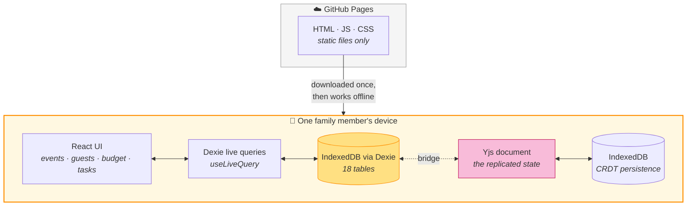
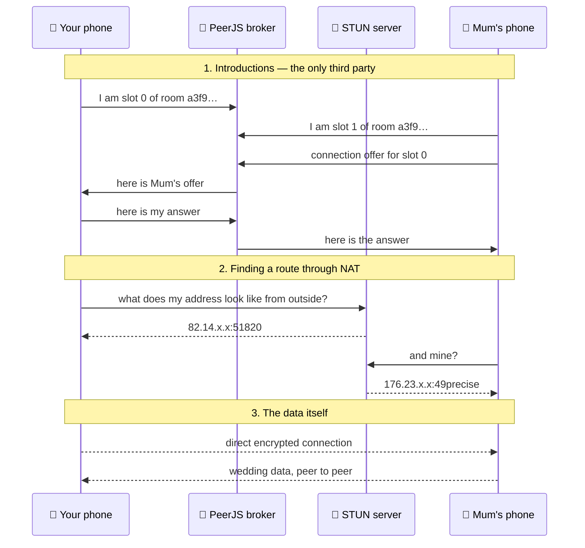
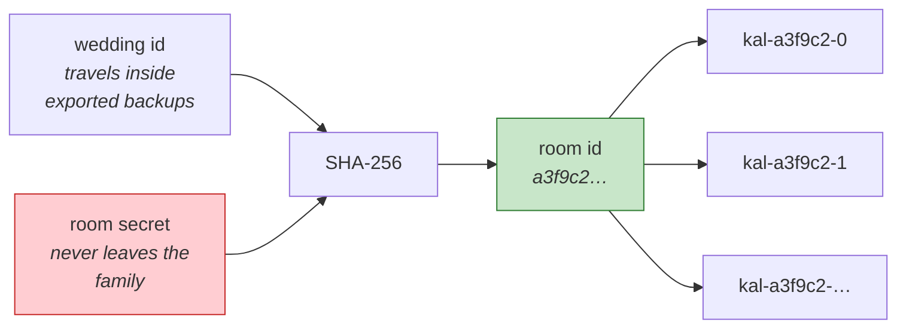
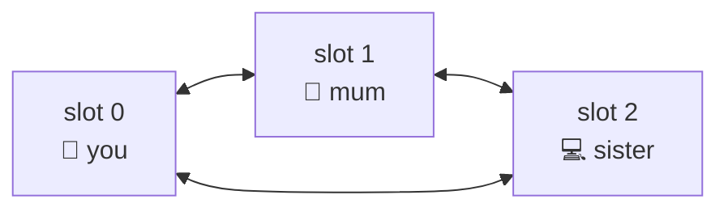
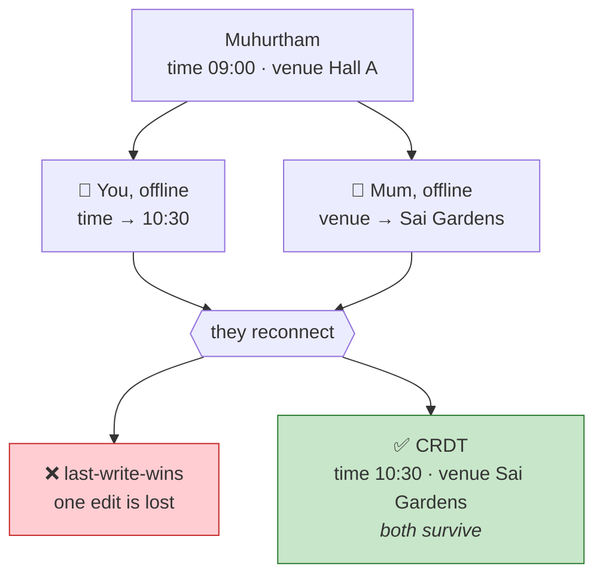
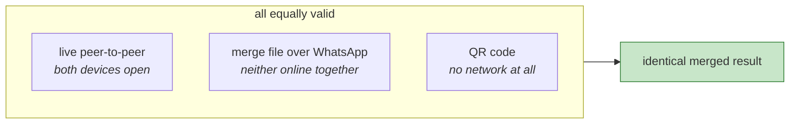
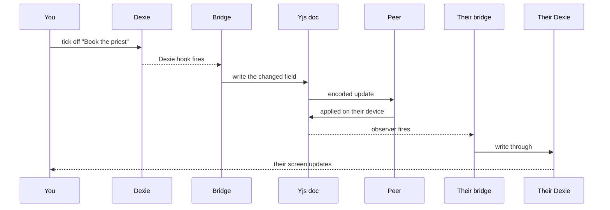
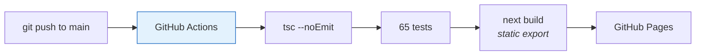

# Kalyanam Architecture

How a wedding planner works with **no backend at all** — no server, no account, no
cloud copy of your family's data — and still keeps everyone's devices in step.

---

## 1. The shape of it

Everything runs in the browser. There is no API to call, because there is no server
to call it on.



GitHub Pages serves files. It never sees your data, because your data never leaves the
device except to go directly to another family member's device.

**Why two stores?** Dexie is what the UI reads and writes — every screen, hook and query
was built against it and still is. The Yjs document is the *replicated* copy: the thing
that knows how to merge with other devices. A bridge keeps them in step, so twelve
thousand lines of UI never had to learn that sync exists.

---

## 2. Why sync is hard without a server

This is the part worth understanding, because the obvious objection is correct:
**two browsers on different networks cannot find each other.**

Your phone on 4G and your mother's phone on the venue's wifi both sit behind NAT. Neither
has a public address. Neither can accept an incoming connection. Without help they are
invisible to one another.

There are three separate problems, and only the first needs anyone else involved:



**What each party actually sees:**

| | What it handles | What it can see |
| --- | --- | --- |
| **PeerJS broker** | Introductions only | That two anonymous ids want to talk. Never any wedding data. |
| **STUN server** | "What is my public address?" | One UDP question. No data at all. |
| **The other device** | Everything | The whole wedding — it is family, that is the point. |

So the honest framing is not *"is there a third party"* but *"what can it see"*. The answer
is: enough to make an introduction, and nothing else.

> **Why not y-webrtc?** It is the usual recommendation, but every public signalling server
> it ships with is dead — its own default, `wss://y-webrtc-eu.fly.dev`, does not respond.
> The PeerJS broker answers in about 100ms and was already a dependency here.

---

## 3. Finding each other without announcing it

A room needs to be findable by family and invisible to everyone else. The room id is
derived by hashing the wedding id together with a secret generated once per wedding:



Both halves are needed, so a leaked backup — which contains the wedding id — does not
reveal the room.

Rather than electing a host, **every device claims the lowest free numbered slot and dials
all the others.** No device is special, and losing one does not break the mesh:



The old six-character sync code is gone. Six characters is roughly 30 bits, and with no
server to exchange them through it could not be made safe — anyone could enumerate them
against the broker. The invite carries the whole secret instead, which is why it is long
enough to want scanning or pasting rather than typing.

---

## 4. What makes offline editing safe

At a wedding, **two people editing at once while offline is the normal case, not the edge
case.** Your mother ticks off a task on the venue's terrible wifi; you change the Muhurtham
time on 4G. Both then reconnect.

A "last sync wins" merge silently throws one of those away. A CRDT does not:



This works because each record is stored as a **map of fields**, not as one opaque blob.
Two people touching different fields never collide at all. When they touch the *same*
field, one value wins — but deterministically, and every device agrees on which.

```
events ─┬─ e1 ─┬─ name    "Muhurtham"
        │      ├─ time    "10:30"        ← changed on your phone
        │      └─ venue   "Sai Gardens"  ← changed on Mum's phone
        └─ e2 ─┬─ name    "Kashi Yatra"
               └─ …
```

---

## 5. Why the merge file matters as much as the network

Because merging is **order-independent and idempotent**, it does not matter *how* the bytes
travel or in what order they arrive. Every transport becomes a valid sync channel:



A **merge file** is not a backup. A backup *replaces*; a merge file *combines*, and applying
it twice is harmless. That is what makes a no-backend design genuinely workable rather than
merely appealing — when nobody is online at the same time, someone sends a file, and the
result is exactly what a live connection would have produced.

| | Backup (`.kalyanam.json`) | Merge file (`.kmerge`) |
| --- | --- | --- |
| Effect | Replaces what is there | Combines both sides |
| Applying twice | Refused as a duplicate | Harmless |
| Use | Safekeeping, moving to a new device | Keeping two devices in step |

---

## 6. How a change travels



The one hazard is an **echo**: applying a remote change writes to Dexie, whose hooks would
mirror it straight back out again, forever. A re-entrancy flag suppresses that — and it has
to be checked *synchronously inside the hook*, because that is the only moment it is
reliably set.

---

## 7. What is deliberately not synced

| Table | Why not |
| --- | --- |
| `messages` | Duplicates what the family already does in WhatsApp |
| `locationPings` / `locationRequests` | Ephemeral and privacy-sensitive |
| `cultures` | Shared templates, seeded locally from the built-ins |
| `appSettings` | A per-device preference, not shared state |

Sync is **opt-in and off by default**. It is the only part of Kalyanam that touches the
network at all.

---

## 8. Build and deployment



Nothing deploys unless the type check and the whole test suite pass first. The output is
static files with a service worker, so the app is installable and works offline.

---

## 9. Trade-offs we accepted

| Choice | Cost | Why anyway |
| --- | --- | --- |
| No backend | Both devices must be open for *live* sync | Nobody hosts or pays for anything, and no server ever holds the family's data. Merge files cover the rest. |
| Public broker | A third party we do not control | It sees introductions only. If it disappears, merge files still work and a relay can be self-hosted — a config change, not a redesign. |
| CRDT over simple sync | More concepts, more bytes | Offline editing by several people is the normal case here, and anything simpler loses edits. |
| Dexie kept alongside Yjs | Two stores to keep in step | The entire existing UI keeps working untouched. |
| Local-first, no accounts | Clearing site data loses everything | No password, no signup, no cloud. Export regularly — the app nags about it. |

---

## 10. Reading the code

```
src/lib/db/schema.ts             18 tables, all the types
src/lib/db/hooks.ts              live queries used by every screen
src/lib/db/records.ts            which tables sync; date field maps
src/lib/sync/export-import.ts    backups (.kalyanam.json)
src/lib/sync/crdt/doc.ts         the replicated document
src/lib/sync/crdt/bridge.ts      Dexie ↔ Yjs, both directions
src/lib/sync/crdt/room.ts        room derivation and invites
src/lib/sync/crdt/peer-provider.ts  sync protocol over PeerJS
src/hooks/use-family-sync.ts     the React entry point
```

See also [SYNC-DESIGN.md](SYNC-DESIGN.md) for the decision record and
[DESIGN-SYSTEM.md](DESIGN-SYSTEM.md) for the design system.
